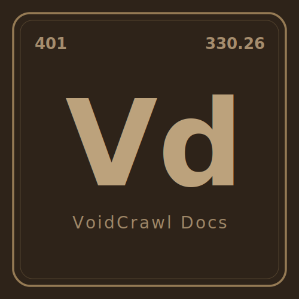

  <a href="https://cascadinglabs.com/voidcrawl">
    <picture>
      <source media="(prefers-color-scheme: dark)" srcset="media/logo-dark.svg">
      <source media="(prefers-color-scheme: light)" srcset="media/logo-light.svg">
      
    </picture>
  </a>

  
  

# VoidCrawl Docs

Source files for the [VoidCrawl](https://github.com/CascadingLabs/VoidCrawl) documentation, served at [cascadinglabs.com/voidcrawl](https://cascadinglabs.com/voidcrawl/).

## License

Apache-2.0
